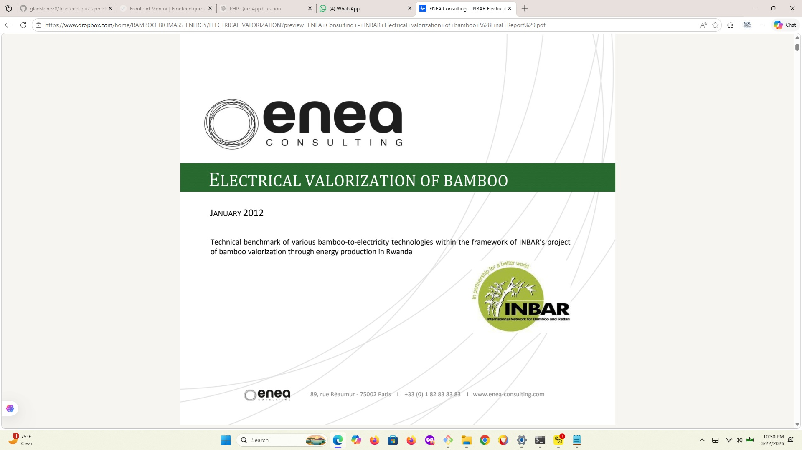

BAMBOO BIOMASS SOLUTIONS FOR ALTERNATIVES TO IMPORT

Bamboo is an amazing source of biomass and can be combined with agrucultural waste fo augment supply

link below to youtube video

https://www.youtube.com/watch?v=RYhysze9UxU&t=548s

[Youtube Video](https://www.youtube.com/watch?v=RYhysze9UxU&t=548s)

[screenshot from video](./screenshoot-bamboo-to-electricity.jpg)

[Electrical Valorization of Bamboo Bookcover](./SCAN-OF-COVER-OF-BOOK.jpg)

[Use of Bamboo Pellets-This video produced in 2023 but even more urgent now in 2026- there are drawbacks but crisis getting worse](./https://www.youtube.com/watch?v=KjIgVaGujYw)

[Bamboo Farming से Carbon Credits: Complete Business Model Step by Step](https://www.youtube.com/watch?v=bNIafzHT_Go)

[Bamboo Farming, Carbon Credits & Ethanol Production | Agritalk by Abhinav Roy (Part 1)](https://www.youtube.com/watch?v=DurN2eppsF4)

[Indias National bmmboo Mision](https://www.youtube.com/shorts/D2LrSOwNU8Q)

